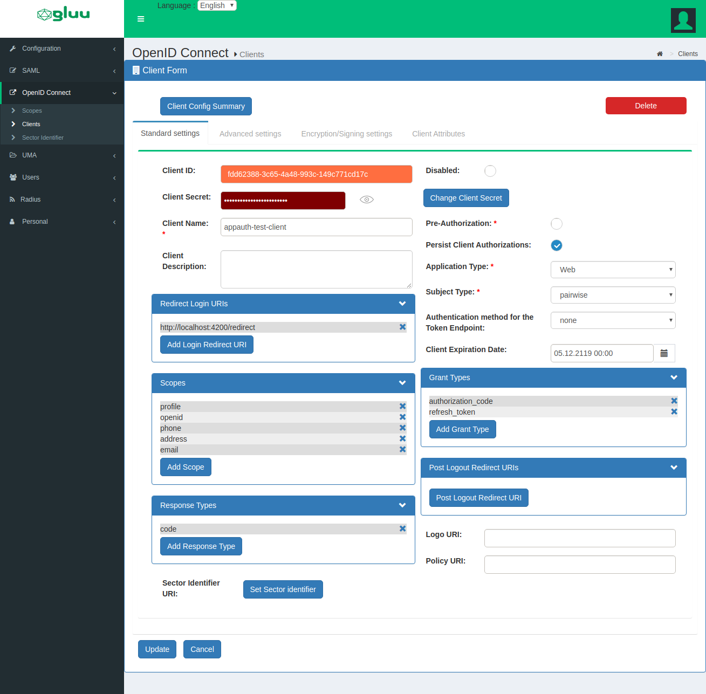

# App-Auth JS Angular Demo

[](angular-appauth-demo.gif)

## Prerequisites
1. Gluu Server 4.0
1. Node JS >= 10.x.x

## Installation
1. Clone this repo

        $ git clone https://github.com/ldeveloperl1985/angular-app-auth-demo.git

1. Install dependency

       $ sudo npm install -g @angular/cli
       $ cd angular-app-auth-demo
       $ npm install

## Start Project

      $ cd angular-app-auth-demo
      $ npm start

It will start you app on `http://localhost:4200`.

## Configuration

1. Use Gluu Admin UI oxTrust to create OP Client. Go to `OpenID Connect > Clients > + Add Client`
   Set `Authnetication method for the Token endpoint : none` because there is no facility in appauth-js to handle this.
   [](client-config.png)

1. Use [environment.ts](https://github.com/ldeveloperl1985/angular-app-auth-demo/blob/master/src/environments/environment.ts) for OP Server and Client configuration in Angular App.
   
## Tips for other SPA Application

1. You need to install first `npm install --save @openid/appauth`.
1. `appauth-js` by default provide the PKCE check.
1. For any operation you need to first fetch configuration `AuthorizationServiceConfiguration.fetchFromIssuer(environment.openid_connect_url)`. Take a look on code [here](https://github.com/ldeveloperl1985/angular-app-auth-demo/blob/master/src/app/home/home.component.ts#L27). you will get idea.
1. The first thing is to generate the authorization url and redirect to OP server for auth. For this please check the [home.component.ts](https://github.com/ldeveloperl1985/angular-app-auth-demo/blob/master/src/app/home/home.component.ts). 
     I've imported the modules like below from appauth-js lib. I think this is the same way for other SPA technologies.
     ```
     import {
         AuthorizationServiceConfigurationJson,
         AuthorizationServiceConfiguration,
         AuthorizationRequest, RedirectRequestHandler
     } from '@openid/appauth';
     ```
1. Second step is after OP auth, OP redirect back to your SPA application to get code from URL and request for `access_token`.
      Check [redirect.component.ts](https://github.com/ldeveloperl1985/angular-app-auth-demo/blob/master/src/app/redirect/redirect.component.ts) for this. 
      Flow start from `this.authorizationHandler.completeAuthorizationRequestIfPossible();` which is responsible for get `code` and `state` from URL and further flow.

## Important

1. There is support in appauth-js to pass and customize the URL parser.

   Use [noHashQueryStringUtils.ts](https://github.com/ldeveloperl1985/angular-app-auth-demo/blob/master/src/app/noHashQueryStringUtils.ts) for custom parser and pass it to `RedirectRequestHandler` and `BaseTokenRequestHandler`. [Reference issue](https://github.com/openid/AppAuth-JS/issues/98)

2. If your provider does not support PKCE then set null last param null in `RedirectRequestHandler`. [Reference issue](https://github.com/openid/AppAuth-JS/issues/98)

   ```
     this.authorizationHandler = new RedirectRequestHandler(
     new LocalStorageBackend(),
     new NoHashQueryStringUtils(), 
     window.location,
     new DefaultCrypto()); // null if your provider does not support PKCE
   ```

3. No need for Jquery, you can pass `fetch` api for request. [Reference issue](https://github.com/openid/AppAuth-JS/issues/100)

   ```
   AuthorizationServiceConfiguration.fetchFromIssuer(environment.openid_connect_url, new FetchRequestor())
   
   this.tokenHandler = new BaseTokenRequestHandler(new FetchRequestor());
   ```
